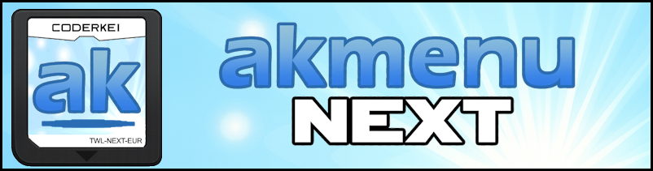

{ align=right width="200"}
# Setting Up AKMenu-Next

!!! info
    
    [AKMenu-Next](https://github.com/coderkei/akmenu-next) is a frontend for nds-bootstrap & Pico-Loader based on a fork of [akmenu4](https://github.com/lifehackerhansol/akmenu4) for running Nintendo DS Software & Homebrew. It supports cheats along with support for Acekard themes.
    For controls such as soft-reset and quitting games, please see [nds-bootstrap controls](https://wiki.ds-homebrew.com/nds-bootstrap/controls)

### Setup Guide:

=== "Flashcarts"

    #### Installing AKMenu-Next Flashcart Edition

    1. Download the latest release of [AKMenu-Next Flashcart Edition.](https://github.com/coderkei/akmenu-next/releases/latest/download/akmenu-next-flashcart.zip)

    1. Extract the downloaded `akmenu-next-flashcart.zip` file with [7-Zip](https://www.7-zip.org/).

    1. From within the AKMenu-Next files, copy the following files/folders to your SD card root:

        - `_nds` folder
        - `_pico` folder
        - `BOOT.NDS`

    !!! warning "Soft-Reset Not Supported for Pico-Loader"

        Note that Pico-Loader inside AKMenu-Next currently does not support soft-resetting to the game menu. If this is important to you, consider using the nds-bootstrap loader within AKMenu-Next.

    !!! warning
        Using the wrong version of Pico-Loader could damage your flashcard!
        If you are unsure which version to use, check the [Supported Platforms section](https://github.com/LNH-team/pico-loader?tab=readme-ov-file#supported-platforms).

    1. Download the latest release of [Pico-Loader](https://github.com/LNH-team/pico-loader/releases/latest). Choose the version that corresponds with your flashcart. If you are unsure [click here](https://github.com/LNH-team/pico-loader#supported-platforms) to see a table where you can match up your flashcart with the corresponding loader. If your flashcart is not on the list, you may skip to "nds-bootstrap installation (Optional)" below.

    1. Extract the downloaded `Pico_Loader_YOUR_FLASHCART_HERE.zip` file with [7-Zip](https://www.7-zip.org/).

    1. Copy the *contents* of the files from the extracted `Pico_Loader_YOUR_FLASHCART_HERE.zip` file to the `_pico` folder on your SD card. Create this folder if it does not exist.

    You can now load `BOOT.NDS` with your flashcart's kernel, or alternatively follow the autoboot steps below.

    !!! info "nds-bootstrap installation (Optional)"

        1. Download the latest release of [nds-bootstrap](https://github.com/DS-Homebrew/nds-bootstrap/releases/latest/download/nds-bootstrap.zip).

        1. Extract the downloaded nds-bootstrap.zip file with [7-Zip](https://www.7-zip.org/).

        1. Copy the contents of the files from the extracted `nds-bootstrap.zip` file to the `_nds` folder on your SD card.

        1. n AKMenu-Next, press `Start` and go to `Settings`. Go to the `Other Settings` tab and change the `Game Loader` to `nds-bootstrap`.   

    #### Autobooting AKMenu-Next

    !!! note

        If you don't see your flashcart in the Autoboot folder or the corresponding one in the `README.TXT` file, skip this section as you will need to use your flashcart kernel to load AKMenu-Next instead. In some cases you can make a copy of `BOOT.NDS` and rename it to `default.nds` to make it chainload autoboot on some flashcart kernels.

    1. Open the `Autoboot` folder within the AKMenu-Next files. Find the folder that corresponds to your flashcart name or type.
    
    1. Copy the *contents* of the folder (do not copy the folder itself) that corresponds with your flashcart to the root of your SD card.

    1. If your flashcart is a DSTTi clone that requires additional boot files, check the `Supplementary DSTTi Clone Files` folder. You can check the [YSMenu compatibility list](https://www.flashcarts.net/ysmenu-compat-ext) to check which one you need. If the file you need is not there, you can make copies of the `TTMenu.dat` file from the `DSTT & DSTTi` folder and rename them accordingly.

    #### Cheats

    1. If you'd like to be able to use cheats on your games, download a [cheat database.](https://gbatemp.net/threads/deadskullzjrs-nds-i-cheat-databases.488711)
    
    1. You will need the `usrcheat.dat` file from the download link in the post. Copy this file to `_nds/akmenunext/cheats/` on your SD card. (Create the `cheats` folder if it doesn't exist)

=== "DSpico"

    #### Installing AKMenu-Next DSpico Edition

    1. Download the latest release of [AKMenu-Next DSpico Edition.](https://github.com/coderkei/akmenu-next/releases/latest/download/akmenu-next-pico.zip)

    1. Extract the downloaded `akmenu-next-pico.zip` file with [7-Zip](https://www.7-zip.org/).

    1. From within the AKMenu-Next files, copy the following files/folders to your SD card root:

        - `_nds` folder
        - `_pico` folder
        - `BOOT.NDS`
        - `_picoboot.nds` (If you wish to autoboot AKMenu-Next)

    !!! warning "Soft-Reset Not Supported for Pico-Loader"

        Note that Pico-Loader inside AKMenu-Next currently does not support soft-resetting to the game menu. If this is important to you, consider using the nds-bootstrap loader within AKMenu-Next.

    1. Download the latest release of [Pico-Loader for DSpico](https://github.com/LNH-team/pico-loader/releases/latest/download/Pico_Loader_DSPICO.zip).

    1. Extract the downloaded `Pico_Loader_DSPICO.zip` file with [7-Zip](https://www.7-zip.org/).

    1. Copy the *contents* of the files from the extracted `Pico_Loader_DSPICO.zip` file to the `_pico` folder on your SD card.

    1. You can now load `BOOT.NDS` from Pico-Launcher kernel, or alternatively autoboot by using the `_picoboot.nds` file.

    !!! info "nds-bootstrap installation (Optional)"

        1. Download the latest release of [nds-bootstrap](https://github.com/DS-Homebrew/nds-bootstrap/releases/latest/download/nds-bootstrap.zip).

        1. Extract the downloaded nds-bootstrap.zip file with [7-Zip](https://www.7-zip.org/).

        1. Copy the contents of the files from the extracted `nds-bootstrap.zip` file to the `_nds` folder on your SD card.

        1. In AKMenu-Next, press `Start` and go to `Settings`. Go to the `nds-bootstrap settings` tab and change the `Game Loader` to `nds-bootstrap`. 

    #### Cheats

    1. If you'd like to be able to use cheats on your games, download a [cheat database.](https://gbatemp.net/threads/deadskullzjrs-nds-i-cheat-databases.488711)
    
    1. You will need the `usrcheat.dat` file from the download link in the post. Copy this file to `_nds/akmenunext/cheats/` on your SD card. (Create the `cheats` folder if it doesn't exist)

    #### Running DSiWare (DSi & 3DS only)

    Please see [this guide](dsiware.md) for running DSiWare on a DSpico.

=== "Nintendo DSi"

    !!! note

        This requires a modded Nintendo DSi system. If your Nintendo DSi is not modded, please follow [dsi.cfw.guide](https://dsi.cfw.guide) to install it.

    #### Installing AKMenu-Next Nintendo DSi Edition

    1. Download the latest release of [AKMenu-Next DSi Edition.](https://github.com/coderkei/akmenu-next/releases/latest/download/akmenu-next-dsi.zip)

    1. Extract the downloaded `akmenu-next-dsi.zip` file with [7-Zip](https://www.7-zip.org/).

        !!! warning

            If you are using TWiLight Menu++ and want to dual boot AKMenu-Next, do not copy over `BOOT.NDS` as this will overwrite the one TWiLight Menu++ uses.
            You can instead launch `akmenu-next.dsi` with TWiLight Menu++ or Unlaunch.

    1. From within the AKMenu-Next files, copy the following files/folders to your SD card root:

        - `_nds` folder
        - `BOOT.NDS` (Please read the warning above)
        - `akmenu-next.dsi`
        - `title` folder (if using HiyaCFW)

    1. Download the latest release of [nds-bootstrap.](https://github.com/DS-Homebrew/nds-bootstrap/releases/latest/download/nds-bootstrap.zip)

    1. Extract the downloaded `nds-bootstrap.zip` file with [7-Zip](https://www.7-zip.org/).

    1. Copy the *contents* of the files from the extracted `nds-bootstrap.zip` file to the `_nds` folder on your SD card.

    1. Load `BOOT.NDS` with your desired entrypoint method (e.g. Memory Pit, stylehax or Flipnote Lenny). Alternatively, use Unlaunch or TWiLight Menu++ to boot `akmenu-next.dsi`. If you are using HiyaCFW, it will appear as an app on your home screen, provding that you copied the `title` folder.

    #### Cheats

    1. If you'd like to be able to use cheats on your games, download a [cheat database.](https://gbatemp.net/threads/deadskullzjrs-nds-i-cheat-databases.488711)
    
    1. You will need the `usrcheat.dat` file from the download link in the post. Copy this file to `_nds/akmenunext/cheats/` on your SD card. (Create the `cheats` folder if it doesn't exist)

    #### Autobooting AKMenu-Next

    !!! note
        Autobooting AKMenu-Next on a DSi requires [Unlaunch](https://dsi.cfw.guide/installing-unlaunch.html) or [Astronaut](https://github.com/Vickerinox/Astronaut/releases/latest) to be installed.

    === "Unlaunch Users"

        1. Turn on your DSi while holding A and B

        1. In the Unlaunch menu, go to OPTIONS

        1. Set NO BUTTON or a button of your choice to the `akmenu-next` entry that says `akmenu-next.dsi` on the bottom screen

        1. Switch off your DSi and switch it back on, it will now automatically boot into AKMenu-Next
    
    === "Astronaut Users"

        1. Turn on your DSi while holding A and B

        1. In the Astronaut menu, go to `Settings`, then go to `Change Boot Options`

        1. Select `default boot option` and choose `Launch something from SD`

        1. Locate `akmenu-next.dsi` on the SD card and select it

        1. Press `go back` at the bottom and then `Save` on the previous screen

        1. Switch off your DSi and switch it back on, it will now automatically boot into AKMenu-Next

=== "Nintendo 3DS"

    !!! note

        This requires a modded Nintendo 3DS system. If your Nintendo 3DS is not modded, please follow [3ds.hacks.guide](https://3ds.hacks.guide) to install it. This guide is also applicable to the Nintendo 2DS models but will be referenced as a 3DS in the steps below.

    #### Installing AKMenu-Next Nintendo 3DS Edition

    1. Download the latest release of [AKMenu-Next 3DS Edition.](https://github.com/coderkei/akmenu-next/releases/latest/download/akmenu-next-3ds.zip)

    1. Extract the downloaded `akmenu-next-3ds.zip` file with [7-Zip](https://www.7-zip.org/).

        !!! warning

            If you are using TWiLight Menu++ on your Nintendo 3DS and want to also use AKMenu-Next, do not copy over `BOOT.NDS` as this will overwrite the one TWiLight Menu++ uses.

    1. From within the AKMenu-Next files, copy the following files/folders to your SD card root:

        - `_nds` folder
        - `BOOT.NDS` (Please read the warning above)
        - `akmenu-next.cia`

    1. Download the latest release of [nds-bootstrap.](https://github.com/DS-Homebrew/nds-bootstrap/releases/latest/download/nds-bootstrap.zip)

    1. Extract the downloaded `nds-bootstrap.zip` file with [7-Zip](https://www.7-zip.org/).

    1. Copy the *contents* of the files from the extracted `nds-bootstrap.zip` file to the `_nds` folder on your SD card.

    1. Boot up your Nintendo 3DS. Open the FBI app, go to your SD card, and find the `akmenu-next.cia` file. Select the cia, then choose "Install CIA".

    1. Launch the `akmenu-next` application from the 3DS home screen.
    
    !!! tip
    
        If you are upgrading from an older version of AKMenu-Next, or if AKMenu-Next does not appear on your 3DS home screen after installing the cia, restart your 3DS.

    #### Cheats

    1. If you'd like to be able to use cheats on your games, download a [cheat database.](https://gbatemp.net/threads/deadskullzjrs-nds-i-cheat-databases.488711)
    
    1. You will need the `usrcheat.dat` file from the download link in the post. Copy this file to `_nds/akmenunext/cheats/` on your SD card. (Create the `cheats` folder if it doesn't exist)

=== "Updating"

    !!! info

        AKMenu-Next, nds-bootstrap and Pico-Loader must be updated seperately of each other.
        If you wish to check for the latest version of AKMenu-Next, nds-bootstrap and Pico-Loader, you can view the latest versions & changelog from the Github releases linked here: [AKMenu-Next Releases](https://github.com/coderkei/akmenu-next/releases/latest) - [nds-bootstrap Releases](https://github.com/DS-Homebrew/nds-bootstrap/releases/latest) - [Pico-Loader Releases](https://github.com/LNH-team/pico-loader/releases/latest)

    #### Updating AKMenu-Next

    === "Flashcart"

        1. Download the latest release of [AKMenu-Next Flashcart Edition.](https://github.com/coderkei/akmenu-next/releases/latest/download/akmenu-next-flashcart.zip)

        1. Extract the downloaded `akmenu-next-flashcart.zip` file with [7-Zip](https://www.7-zip.org/).

        1. From within the akmenu-next files, copy the following files/folders to your SD card root:

            - `_nds` folder
            - `BOOT.NDS`

        1. Overwrite the existing files. If you are on MacOS ensure you click `Merge` and not `Replace`, otherwise themes, plugins & cheats may be deleted.

    === "DSpico"

        1. Download the latest release of [AKMenu-Next DSpico Edition.](https://github.com/coderkei/akmenu-next/releases/latest/download/akmenu-next-pico.zip)

        1. Extract the downloaded `akmenu-next-pico.zip` file with [7-Zip](https://www.7-zip.org/).

        1. From within the akmenu-next files, copy the following files/folders to your SD card root:

            - `_nds` folder
            - `BOOT.NDS`
            - `_picoboot.nds` (If you wish to autoboot AKMenu-Next)

        1. Overwrite the existing files. If you are on MacOS ensure you click `Merge` and not `Replace`, otherwise themes, plugins & cheats may be deleted.

    === "Nintendo DSi"

        1. Download the latest release of [AKMenu-Next DSi Edition.](https://github.com/coderkei/akmenu-next/releases/latest/download/akmenu-next-dsi.zip)

        1. Extract the downloaded `akmenu-next-dsi.zip` file with [7-Zip](https://www.7-zip.org/).

        1. From within the akmenu-next files, copy the following files/folders to your SD card root:

            - `_nds` folder
            - `BOOT.NDS` (If you use Twilightmenu++, skip this file)
            - `akmenu-next.dsi`
            - If you have AKMenu-Next installed as an app on HiyaCFW, copy over the `title` folder.

        1. Overwrite the existing files. If you are on MacOS ensure you click `Merge` and not `Replace`, otherwise themes, plugins & cheats may be deleted.

    === "Nintendo 3DS"

        1. Download the latest release of [AKMenu-Next DSi Edition.](https://github.com/coderkei/akmenu-next/releases/latest/download/akmenu-next-3ds.zip)

        1. Extract the downloaded `akmenu-next-3ds.zip` file with [7-Zip](https://www.7-zip.org/).

        1. From within the akmenu-next files, copy the following files/folders to your SD card root:

            - `_nds` folder
            - `BOOT.NDS` (If you use Twilightmenu++, skip this file)
            - `akmenu-next.cia`

        1. Overwrite the existing files. If you are on MacOS ensure you click `Merge` and not `Replace`, otherwise themes, plugins & cheats may be deleted.

        1. Install the `akmenu-next.cia` file with FBI, you may need to restart your 3DS console afterwards to use the new version.

    === "Updating nds-bootstrap"

        1. Download the latest release of [nds-bootstrap.](https://github.com/DS-Homebrew/nds-bootstrap/releases/latest/download/nds-bootstrap.zip)

        1. Extract the downloaded `nds-bootstrap.zip` file with [7-Zip](https://www.7-zip.org/).

        1. Copy the *contents* of the files from the extracted `nds-bootstrap.zip` file to the `_nds` folder on your SD card.

    === "Updating Pico-Loader"

        1. Download the latest release of [Pico-Loader](https://github.com/LNH-team/pico-loader/releases/latest). Choose the version that corresponds with your flashcart. If you are unsure [click here](https://github.com/LNH-team/pico-loader#supported-platforms) to see a table where you can match up your flashcart with the corresponding loader.

        1. Extract the downloaded `Pico_Loader_for_YOUR_FLASHCART_HERE.zip` file with [7-Zip](https://www.7-zip.org/).

        1. Copy the *contents* of the files from the extracted `Pico_Loader_for_YOUR_FLASHCART_HERE.zip` file to the `_pico` folder on your SD card. Create this folder if it does not exist.

!!! info

    Need help or want to discuss AKMenu-Next? Check out the [AKMenu-Next GBATemp Thread](https://gbatemp.net/threads/ds-i-3ds-akmenu-next-wood-frontend-for-nds-bootstrap-pico-loader.665743/)
