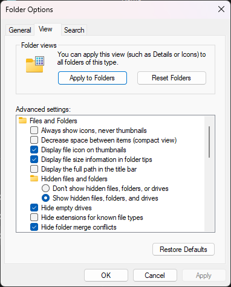

### DSpico with AKMenu-Next (DSpico only)

!!! info "Console Compatibility"

    This only works if your DSpico with AKMenu-Next is running on a DSi or 3DS system. It will not load DSiWare on the Original NDS or DS Lite, since those consoles are missing the upgraded DSi hardware for running DSi-mode apps.

1. Download the [DSpico BIOS and NAND dumper utility.](https://files.deletecat.com/projects/pico_file_dump/current/pico_file_dump.nds)

1. Place `pico_file_dump.nds` on your DSpico's SD card root.

1. Create a `DSiWare` folder on your SD card root, and place any DSiWare ROMs you'd like to play inside.

    !!! note "DSiWare File Types"

        If your DSiWare dump is a file with no file extension, you can change the filename and add `.nds` to the end to get AKMenu-Next to pick it up.

1. Eject the SD card, insert it back into your DSpico, then boot into the cart.

1. In the menu, navigate to and launch `pico_file_dump.nds`. Dumping will begin.

1. Once all files have been dumped, press the power button to turn off the system.

1. Boot up AKMenu-Next and ensure that `Game Loader` in settings is set to `Pico-Loader`.

1. DSiWare and encrypted DS ROMs can now be played! Navigate to the `DSiWare` folder and launch a game to play.

**Optional Filesystem Cleanup**

If you don't like the folder clutter caused by copying all the NAND files to the DSpico SD card, you can hide them from the menu by setting the hidden attribute on any files or folders you want hidden.
    
!!! note "Windows-only"

    The following instructions assume Windows is used. Linux/Mac instructions will be added later, but it is possible to hide files and folders on those operating systems as well, with different steps.

1. Navigate to the SD card root on your PC's file explorer.

1. While holding the CTRL (Control) key, click on any folders you would like to hide from AKMenu-Next's file list. The following files and folders are recommended to be hidden:
    - `_pico` folder
    - `photo` folder
    - `shared1` folder
    - `shared2` folder
    - `sys` folder
    - `_picoboot.nds`
    - `boot.nds`

1. After selecting the last file, release the CTRL key, then right click on one of the selected files. In the right click menu, select `Properties`.

1. A properties window will open. Under the `Attributes` section, check the `Hidden` box, then press `OK`.

1. A pop-up window will appear asking to confirm changes. Choose "Apply changes to the selected items, subfolders, and files", then press `OK`.

1. The selected files should disappear from the file manager. This is normal. You can view them again by enabling "Show hidden files" in File Explorer's "Folder Options" menu.
    - {align=left width="300"}
    
1. Since the BIOS and NAND files have already been dumped, `pico_file_dump.nds` is no longer necessary and can be deleted from the SD card root.

1. Insert the SD card back into your DSpico and boot into the menu. The hidden files should no longer show up in the menu list, but DSiWare will still work!
